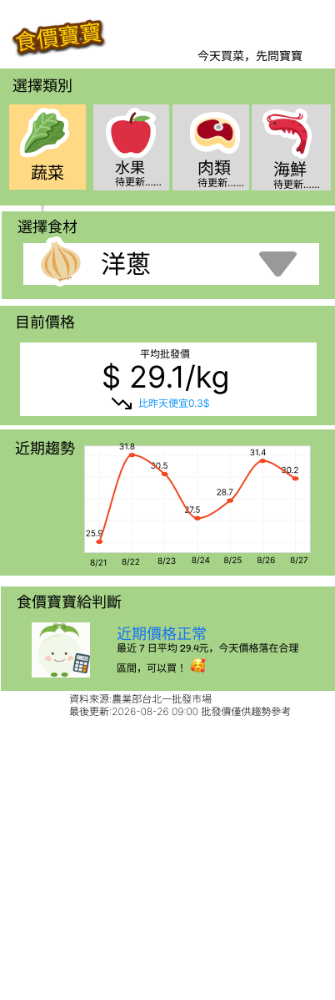

食價寶寶 #台北市場價格追蹤器

線上體驗：https://shijiabaobao.streamlit.app

##專案背景與目標

台灣近年物價持續上漲，日常買菜的花費也越來越有感。這個專案源於一個實際生活需求：希望在前往住家附近（台北市大同區太平市場）買菜前，能有一個批發市場價格趨勢作為參考依據，判斷當下品項是「正常價位」還是「近期偏貴」。

專案定位為個人的產品發想與執行練習：從需求定義、資料源評估、規格拆解，透過 AI 協作完成技術實作與落地，驗證「模糊的生活痛點」到「可運作的自動化系統」的完整過程。

##我在這個專案中做的事

##需求定義與範圍界定

評估「太平市場零售價」沒有公開資料源可用後，重新定義MVP範圍：改以台北批發市場價格作為趨勢參考指標，而非直接對應零售價格
篩選出15項家庭常用蔬菜作為第一階段追蹤範圍，而非一次涵蓋所有品項
上線後重新檢視資料代表性：發現單一市場（台北一）無法完整反映雙北供應鏈全貌，決策擴充納入台北二（三重）市場，並設計加權平均邏輯產出「雙北綜合」指標，優先於「直接比對單一零售市場」的方向，作為更貼近使用情境的階段性解法

##需求拆解與規格制定

發現「日常口語」與「政府資料系統正式名稱」不一致（例如「高麗菜」在系統裡是「甘藍」、「地瓜葉」曾被誤判為「蕹菜」），透過人工比對北農官方品項代碼表，逐一驗證並建立標準化對照表（vegetables.csv），作為後續系統開發的規格依據
決策同一品項下多個細分品種（如甘藍分初秋、改良種、紫色等）的資料保留策略：選擇「先完整保留，顯示邏輯後續再調整」，避免過早限縮資料價值
針對「公斤 vs 台斤」的單位落差（台灣消費者習慣以台斤議價，官方資料則以公斤計價），決策採用「保留原始公斤數據、新增衍生台斤欄位」的資料庫設計原則，避免覆蓋原始數據導致後續無法追溯或校驗
針對雙市場價格如何綜合呈現，評估簡單平均與加權平均的差異後，決策採用「以交易量加權」的計算方式，避免小規模市場的價格波動不成比例地影響整體代表性數值

##風險評估與應對

測試過程中發現政府開放資料API有間歇性連線不穩定的狀況，主動要求技術端加入容錯機制（單一品項失敗不影響整體流程），確保自動化排程的穩定性
發現初版資料儲存方式（每次覆蓋）無法支援「累積歷史趨勢」這個核心目的，主動提出並推動架構調整（改用SQLite搭配去重複邏輯）
擴充雙市場資料來源前，先以小範圍測試（單一品項、限定天數）驗證新市場資料的可得性與完整性，確認可行後才正式導入正式流程，降低架構調整的風險
排程自動化（GitHub Actions）與本地端手動操作並存時，發生資料庫檔案版本衝突，透過釐清雙寫入來源的架構限制，制定衝突排解流程，並評估後續優化方向（如資料庫脫離版控、分離讀寫來源）

##專案執行與工具協作

使用AI協作工具（Claude）作為技術實作夥伴，本人負責需求判斷、資料驗證、問題排查與決策，逐步完成從API串接、資料儲存到自動化排程（GitHub Actions）的完整流程
過程中排除多項實際部署問題（環境設定、版本控制、雲端執行權限、Git合併衝突等），驗證了在不具備專業工程背景下，仍能有效定義需求並推動技術落地的能力
資料來源

農業部「農產品交易行情」開放資料API（https://data.moa.gov.tw），追蹤台北一、台北二（三重）批發市場的批發價格，並以交易量加權計算「雙北綜合」平均價，每日透過GitHub Actions自動排程更新。

##技術架構
Python + requests：串接政府開放資料API，同時抓取雙市場資料
Pandas：資料彙整與加權平均計算
SQLite：累積式儲存歷史價格，並以唯一鍵避免重複寫入；同時儲存公斤原始值與台斤衍生值，供不同使用情境查詢
GitHub Actions：每日自動排程執行、更新並回寫資料庫
Streamlit + Plotly：資料視覺化網頁，支援市場別（台北一／台北二／雙北綜合）與單位（公斤／台斤）切換、特定日期查詢、趨勢圖表與明細表格
Figma：介面線框稿（Wireframe）設計，含產品定位與差異化分析

專案進度
 需求定義與資料源可行性評估
 品項規格對照表建立與驗證
 資料抓取與容錯機制
 SQLite累積式儲存架構
 每日自動排程（GitHub Actions）
 資料視覺化網頁（Streamlit，線上可體驗）
 公斤／台斤單位切換
 雙北（台北一＋台北二）資料整合與加權平均綜合指標
 特定日期查詢與每日價格明細表格
 Figma介面規劃稿（含產品差異化定位分析）
 太平市場實際零售價比對（規劃中）

## 🎨 介面設計稿（Figma Wireframe）

